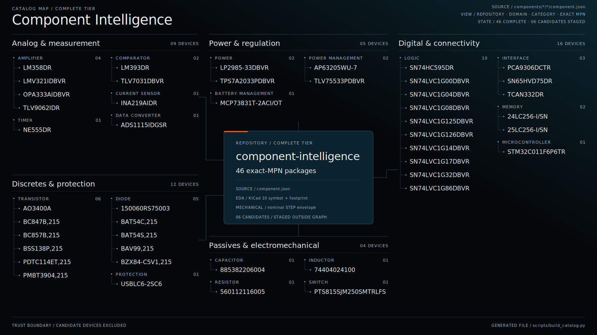

<p align="center">
  <a href="CATALOG.md">
    
  </a>
</p>

# Component Intelligence

[](https://github.com/lyon-industries/component-intelligence/actions/workflows/validate.yml)

Source-linked exact-MPN records with native KiCad 10 symbols, footprints, and
nominal STEP models for engineering agents and engineers who want an
inspectable starting point.

Use this repository to preflight a part, trace normalized data back to exact
manufacturer pages, and bring mutually consistent native assets into a design.
Do not treat it as an official manufacturer library, a substitute for your
company's library review, or approval to fabricate a board.

## Audited state

As of 2026-07-18:

- **46 complete packages** in [`catalog.json`](catalog.json)
- **6 incomplete candidates** quarantined in
  [`candidate-catalog.json`](candidate-catalog.json)
- **59 recorded integration findings**
- **0 packages claiming physical test evidence**

The browsable [`CATALOG.md`](CATALOG.md) shows every exact MPN, manufacturer,
function, package, review date, and physical-evidence state.
The dated [`launch-readiness audit`](docs/LAUNCH-AUDIT-2026-07-18.md) records
the adversarial findings, corrections, residual limits, and channel decision.

The catalog now includes exact-MPN examples across passives, discrete devices,
power, interfaces, logic, sensing, memory, protection, switches, and
microcontrollers. The launch additions include a 10 kΩ 0603 resistor, 100 nF
0603 MLCC, 10 µH power inductor, red 0603 LED, INA219 current monitor, and
74HC595 shift register. These are manufacturer-specific parts, not generic
value aliases.

## Use it for

- source-traceable part selection and agent retrieval
- a reviewable symbol, footprint, and mechanical-envelope starting point
- exact pin, pad, package, rating-boundary, provenance, and rights data
- catching integration constraints before schematic or layout work
- returning field corrections without silently weakening the default catalog

## Do not assume

- a `complete` package has been assembled, measured, or production-qualified
- a nominal STEP model reproduces every tolerance, marking, or lead-form detail
- a functional symbol matches your house style or preferred multi-unit layout
- the supplied paste and mask geometry fits every stencil, finish, fab, or
  assembly process
- correct component CAD makes the surrounding circuit electrically safe

## KiCad quick start

The generated project-local library tables expose only complete packages.

1. Clone the repository and pin the commit used by your design.
2. In KiCad 10, open **Preferences → Configure Paths** and add
   `COMPONENT_INTELLIGENCE_ROOT` with the absolute path to this repository.
3. For a new project with no project-specific tables, copy
   [`kicad/sym-lib-table`](kicad/sym-lib-table) and
   [`kicad/fp-lib-table`](kicad/fp-lib-table) into the project directory.
4. For an existing project, merge the desired entries through KiCad's Symbol
   and Footprint Library managers; do not overwrite existing tables.
5. Inspect the exact package suffix, pin map, pad geometry, orientation, and
   process assumptions before fabrication.

See [`docs/KICAD.md`](docs/KICAD.md) for native-name handling, the current KLC
audit, the deliberate 3D-path deviation, and a pre-fabrication checklist.

## Remote agent workflow

Consumers do not need to clone this repository or run Python. The versioned
JSON files and declared asset paths are the public interface.

1. Fetch `catalog.json` from GitHub at a pinned commit.
2. Select an exact MPN from that complete-package index.
3. Fetch the listed `component.json` path at the same commit.
4. Fetch the symbol, footprint, and STEP paths declared in that record.
5. Read the integration findings and apply the consuming toolchain's own
   approval gate.

```text
https://raw.githubusercontent.com/lyon-industries/component-intelligence/<commit>/catalog.json
https://raw.githubusercontent.com/lyon-industries/component-intelligence/<commit>/<record-path>
https://raw.githubusercontent.com/lyon-industries/component-intelligence/<commit>/<asset-path>
```

The catalog entry supplies `<record-path>`. Asset paths in `component.json` are
relative to that record's directory. Pinning one commit prevents a consumer
from mixing records and assets from different dataset states.

Treat catalog paths as repository paths, not pre-encoded URLs. URL-encode each
path segment before inserting it into a raw GitHub or Contents API URL. A
literal `%2F` in a repository path represents an encoded MPN character and must
appear as `%252F` in the request URL. Do not decode the catalog path first.

## What `complete` means

`catalog.json` contains only directories under `components/`. Admission means
the repository's current local gate found:

- an exact manufacturer, MPN, package, and official-source trail
- normalized pins, ratings, package facts, and recorded comparison methods
- deterministic native symbol and footprint replay from the canonical record
- exact symbol-pin and footprint-pad agreement, including electrical types
- copper, paste, mask, silkscreen-clearance, pin-one, fab, and courtyard checks
- a STEP file that reopens as solid geometry at the declared seating plane and
  covers the declared nominal envelope
- matching hashes, provenance, limitations, rights, and generated indexes
- no active `fabrication-stop` finding

This is a repository-local data and CAD gate. It is not independent
certification, a KiCad endorsement, or product qualification. See
[`QUALITY.md`](QUALITY.md) for the exact contract.

## Candidate work

`candidate-catalog.json` indexes directories under `candidates/`. Candidates
may contain useful source-backed facts or failure reports, but they are
excluded from the generated KiCad tables and ordinary component discovery.

The corrected INA219 SOT-23-8 candidate demonstrates this boundary: its exact
part status and pin map are retained, while an unsupported land-pattern claim
was removed and the missing DCN geometry remains a fabrication-stop finding.

## Repository layout

```text
catalog.json                    # complete packages only
candidate-catalog.json          # incomplete collaborative work
CATALOG.md                      # generated human-readable index
kicad/                          # generated complete-tier library tables
assets/component-catalog-graph.svg # generated 16:9 complete-tier graph
components/<maker>/<mpn>/       # complete package trust tier
candidates/<maker>/<mpn>/       # incomplete collaborative tier
schema/component.schema.json
scripts/build_catalog.py        # catalogs, summaries, tables, graph
scripts/generate_component_graph.py
scripts/generate_native_assets.py
scripts/validate.py             # trust-boundary and native-asset gate
```

Exact MPN spelling remains canonical in `component.json`. Repository directory
names percent-encode reserved MPN characters, while KiCad-native filenames use
a deterministic safe name. Never infer the exact MPN from a filename.

## Report a component problem

Wrong pins, pad geometry, source locators, mechanical envelopes, assembly
failures, or application constraints are useful evidence. Open a
[component error or correction](https://github.com/lyon-industries/component-intelligence/issues/new?template=component-error.yml)
with the exact MPN, pinned record, source locator, tool version, and the smallest
reproducible artifact you can share.

A serious finding against a complete package must be fixed or demoted to the
candidate tier in the same change. See [`CONTRIBUTING.md`](CONTRIBUTING.md).

## Maintainer validation

```sh
python3 -m venv .venv
. .venv/bin/activate
python -m pip install -r requirements-dev.txt
python scripts/build_catalog.py
python scripts/build_catalog.py --check
python scripts/validate.py
python -m unittest discover -s tests -v
```

## License and source rights

Original repository content is Apache-2.0. Manufacturer and product names
identify referenced parts. Linked manufacturer documents are not redistributed
or relicensed by default. Every included CAD asset records its provenance,
limitations, and source basis.
