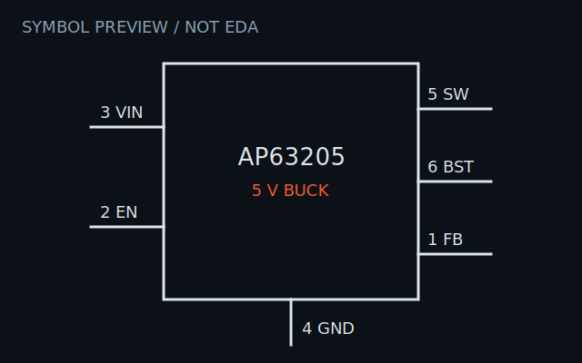
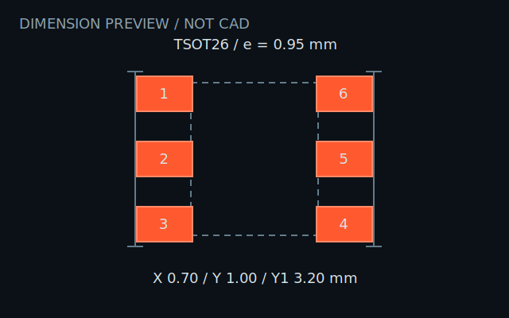

# AP63205WU-7

Fixed 5 V, 1.1 MHz synchronous buck converter in the Diodes Incorporated
TSOT26 package.

The machine-readable record contains the six-pin map, operating ratings,
package dimensions, official locators, CAD state, assembly metadata, and two
integration failures found during a PCB qualification case.

Status: cross-checked source record; no physical qualification. The SVGs are
inspection previews, not EDA or manufacturing files.

Official source:
[AP63200/AP63201/AP63203/AP63205 datasheet](https://www.diodes.com/datasheet/download/AP63200-AP63201-AP63203-AP63205.pdf)
