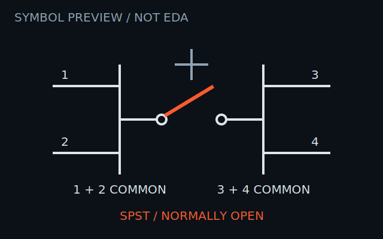
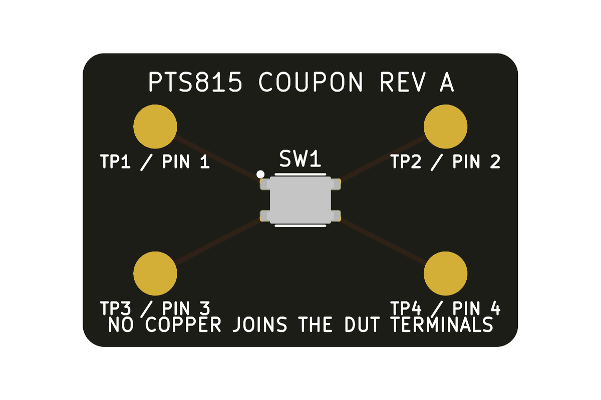

# PTS815SJM250SMTRLFS

Qualification candidate for the exact Littelfuse/C&K
`PTS815SJM250SMTRLFS` top-actuated SMT tactile switch. It is not yet
`agent-ready`: the source record and digital assets are substantially complete,
but the exact footprint and part have not been fabricated, assembled, inspected,
or continuity-tested.




The images above are KiCad-generated digital inspection artifacts. The 3D image
is a model render, not a photograph or evidence of a fabricated part.



The coupon image is also a digital render. No physical coupon or assembled
switch is being claimed.

Both PCB images use the repository's `lyon-industries-pcb-v1` inspection
style: a pure-white background, black solder mask, white silkscreen, exposed
ENIG copper rendered gold, and 1.5 mm board-corner radii. The model image uses
a clearly marked non-fabrication render fixture; the qualification image uses
the actual Rev A coupon source.

## Electrical contract

- Momentary SPST, normally open.
- Terminals 1 and 2 are internally common.
- Terminals 3 and 4 are internally common.
- Actuation closes the connection between the two common terminal groups.
- Maximum rating: 12 VDC and 50 mA. These are limits, not a recommended design
  target.
- Initial contact resistance is at most 100 mΩ; contact bounce is at most
  10 ms. The consuming circuit or firmware still needs suitable debounce.
- Operating temperature is −40 °C to 90 °C.
- The reviewed source does not qualify this part for automotive, medical, or
  safety equipment. Obtain the contractual specification package before such
  use.

The critical topology detail is the horizontal grouping in the manufacturer's
top view: pads 1–2 form one pole and pads 3–4 form the other. A prior two-pad
abstraction crossed those groups and would have held the connected signal
shorted while the button was released.

## Native assets

- `PTS815SJM250SMTRLFS.kicad_sym`: KiCad symbol with all four passive pins and
  visible common-pair semantics.
- `PTS815SJM250SMTRLFS.pretty/PTS815SJM250SMTRLFS.kicad_mod`: KiCad footprint
  with four 1.0 mm × 0.7 mm round-rectangle lands, one-to-one paste, 0.05 mm
  mask expansion, a courtyard, fabrication outline, pad-1 marks, and the STEP
  reference.
- `PTS815SJM250SMTRLFS.3dshapes/PTS815SJM250SMTRLFS.step`: original nominal
  mechanical-clearance model. It covers seating, orientation, and the
  4.6 mm × 3.2 mm × 2.5 mm envelope; it does not claim undocumented internal or
  cosmetic detail.
- `symbol.svg` and `footprint.svg`: inspection renders only. They have no EDA or
  manufacturing authority.
- `model.png`: KiCad 10.0.4 board-level render used to inspect STEP origin,
  orientation, seating, terminal position, and actuator-up clearance.
- `preview/model-fixture.kicad_pcb`: non-fabrication board source used only to
  render the STEP model against the repository PCB inspection style.

Register the `.pretty` directory as a KiCad footprint library named
`PTS815SJM250SMTRLFS`. Set the KiCad path variable
`COMPONENT_INTELLIGENCE_ROOT` to the root of this repository so the footprint
can resolve its STEP model. Re-run ERC, DRC, and 3D checks after vendoring or
converting the files into another toolchain.

The current digital verification used KiCad 10.0.4. The native symbol parsed
and rendered, a two-net schematic fixture passed ERC with zero violations, the
footprint parsed and rendered, a routed board fixture passed DRC with zero
violations and zero unconnected items, and KiCad loaded the STEP model in top,
side, and perspective board renders.

The checked-in PCB previews can be reproduced from the repository root with
KiCad and the development requirements installed:

```sh
python3 scripts/render_pcb.py \
  components/littelfuse/PTS815SJM250SMTRLFS/preview/model-fixture.kicad_pcb \
  components/littelfuse/PTS815SJM250SMTRLFS/model.png \
  --width 1000 --height 800 --zoom 1.05 --quality high \
  --define-var "COMPONENT_INTELLIGENCE_ROOT=$(pwd)"

python3 scripts/render_pcb.py \
  components/littelfuse/PTS815SJM250SMTRLFS/qualification/coupon-rev-a/pts815-coupon-rev-a.kicad_pcb \
  components/littelfuse/PTS815SJM250SMTRLFS/qualification/coupon-rev-a/coupon-render.png \
  --width 1200 --height 800 --zoom 1.12 \
  --define-var "COMPONENT_INTELLIGENCE_ROOT=$(pwd)"
```

The STEP model can be reproduced without adding a project dependency:

```sh
uv run --python 3.12 --with cadquery==2.8.0 \
  components/littelfuse/PTS815SJM250SMTRLFS/generate_step.py
```

## Assembly boundary

The exact suffix means J-bend SMT, 2.5 mm height, 1.8 ± 0.5 N operating force,
silver-plated RoHS terminals, and tape-and-reel packing in reels of 2,900.
Follow the manufacturer's infrared-reflow profile and use no more than two
reflow cycles. Slightly activated flux is suitable. Wash, conformal-coating,
moisture-sensitivity, and sealed-enclosure suitability are not established by
the reviewed datasheet.

At footprint rotation 0, viewed from above with the actuator facing up, pad 1
is upper-left, pad 2 upper-right, pad 3 lower-left, and pad 4 lower-right. The
filled silkscreen dot and chamfered fabrication corner identify pad 1. Confirm
feeder rotation against the tape drawing and the first placed article. Keep the
actuator accessible and ensure the enclosure does not preload it.

## Physical qualification still required

`qualification/coupon-rev-a/` contains a KiCad 10.0.4 board and machine-readable
qualification plan. The board exposes every switch terminal on an independent
3 mm probe pad; no coupon copper joins any terminal pair. It passes DRC with
zero violations and zero unconnected items. It is ready for fabrication review,
but it has not been ordered, fabricated, or assembled.

Promotion requires a dated coupon using this exact footprint and exact MPN.
The record must include the board and fixture revisions, paste and reflow
process, inspection evidence, instruments, environment, and these minimum
functional checks:

1. With the switch released, verify continuity within 1–2 and within 3–4, and
   verify isolation between the two groups.
2. With the switch actuated, verify closure between the groups without an
   intermittent or mechanically preloaded state.
3. Inspect seating, solder wetting, bridges, pad alignment, actuator access,
   and enclosure clearance.
4. State the measured values and acceptance limits, the actuation count, and
   what the test did not prove.

Until that evidence is committed and independently reviewed, this directory is
for qualification and manual engineering review only—not autonomous schematic
or PCB release.

Official source:
[PTS815 series datasheet, revision VL 02/03/26](https://www.littelfuse.com/assetdocs/littelfuse-c-k-tactile-pts815-series-datasheet?assetguid=1c4ee7c5-01fd-4370-a5cc-03ec62685e73)
